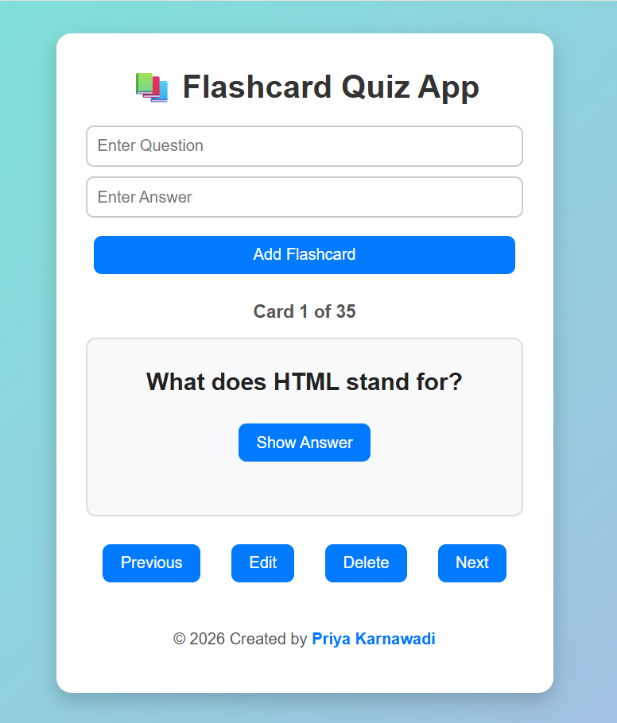

# 📚 Flashcard Quiz App

A simple interactive Flashcard Quiz App built using **HTML, CSS, and JavaScript**. It helps users learn concepts through flashcards with a user-friendly interface.

## 📸 Screenshot

## ✨ Features

- ➕ Add new flashcards
- ✏️ Edit existing flashcards
- 🗑️ Delete flashcards
- ⬅️➡️ Navigate through flashcards
- 👁️ Show/Hide answers
- 📱 Responsive design for mobile and desktop

## 🛠️ Technologies Used

- HTML5
- CSS3
- JavaScript

## 👩‍💻 Created By

**Priya Karnawadi**
